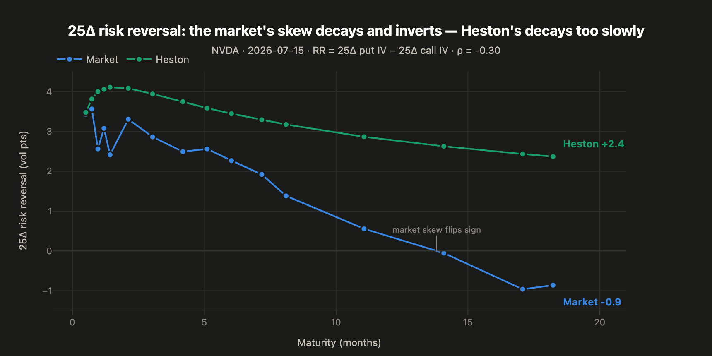
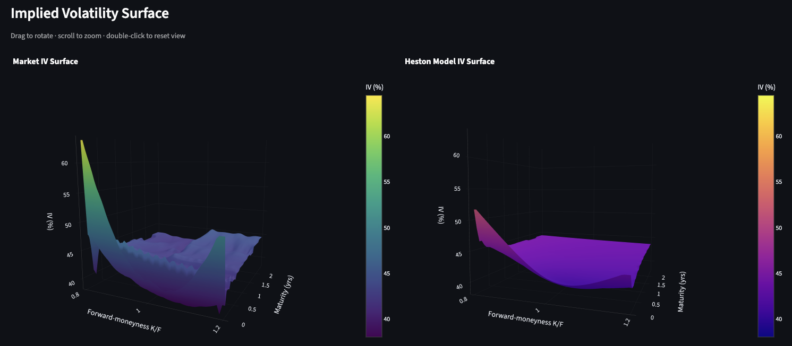
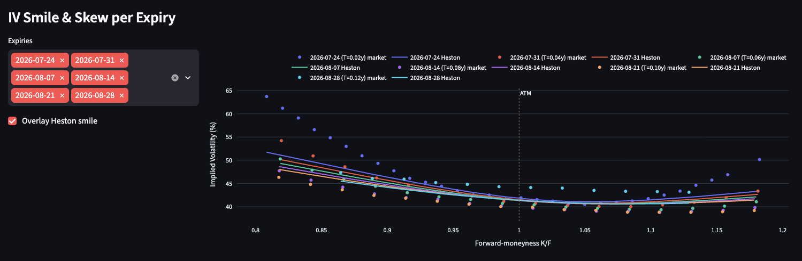

# Heston Options Pricing Engine

Live equity option chains → European-equivalent vol surface → Heston calibration → a measurement of where the model breaks.



**The finding.** NVDA's 25Δ risk reversal decays with maturity and flips sign by ~14 months — long-dated calls are bid. Calibrated Heston decays ~3× too slowly and *cannot* invert at all: the skew's sign is locked to ρ. The near-the-money fit is tight; the long-dated skew is a structural limit of a single variance factor, not a tuning problem.

## Pipeline

Live chain (`yfinance`) → implied forward `F(T)` per expiry from put-call parity → SOFR/OIS discount curve → de-Americanize via a CRR tree → calibrate `(v0, κ, θ, σ, ρ)` → price → surfaces, Greeks, mispricing screen.

Calibration is **Levenberg-Marquardt with a closed-form analytic Jacobian** ([Cui et al., 2016](https://doi.org/10.1016/j.ejor.2017.05.018)) on vega-weighted price residuals, over a **64-node Gauss-Legendre** characteristic-function pricer. American quotes are de-Americanized once up front, so the fast CF pricer handles the whole chain and no early-exercise solver ever enters the optimiser loop.

Typical NVDA run: ~260 contracts, **~1.5 s**, fitting the liquid surface to **~1.8 vol pts** mean IV error.



Per expiry, the fit is tight near the money and misses in the steep short-dated put wing — market IV reaches ~60% at K/F = 0.82 where Heston tops out near 52%.



## Run

```bash
python3 -m venv .venv && source .venv/bin/activate
pip install -r requirements.txt

streamlit run app/Home.py    # fetch → filter → calibrate → price → surfaces → screen
```

Headless:

```bash
python pipelines/run_calibration.py --tickers NVDA --output results.json
```

Data is live-only; the app and pipelines both need network access.

## Layout

| | |
|---|---|
| `models/`, `pricing/` | Cui (2016) CF + analytic gradient; 64-node GL European pricer |
| `calibration/` | LM optimiser, residuals/Jacobian, CRR de-Americanization |
| `data/`, `config/` | live chains, implied forward curve, filters, SOFR/OIS curve |
| `analytics/`, `strategies/`, `risk/` | enrichment, surfaces, payoffs, limits & scenarios |
| `services/` | orchestration boundary — app and CLI call these |
| `app/`, `pipelines/` | Streamlit UI; headless entry points |
